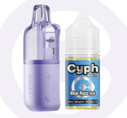
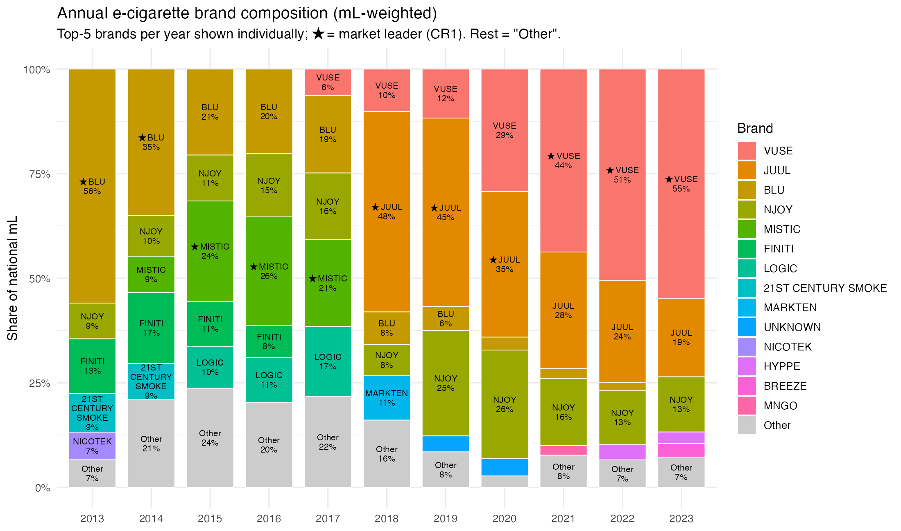
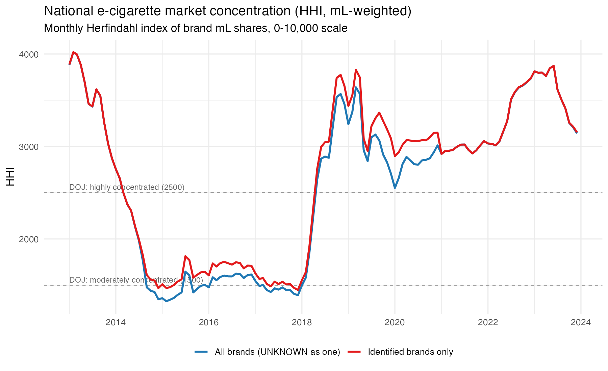
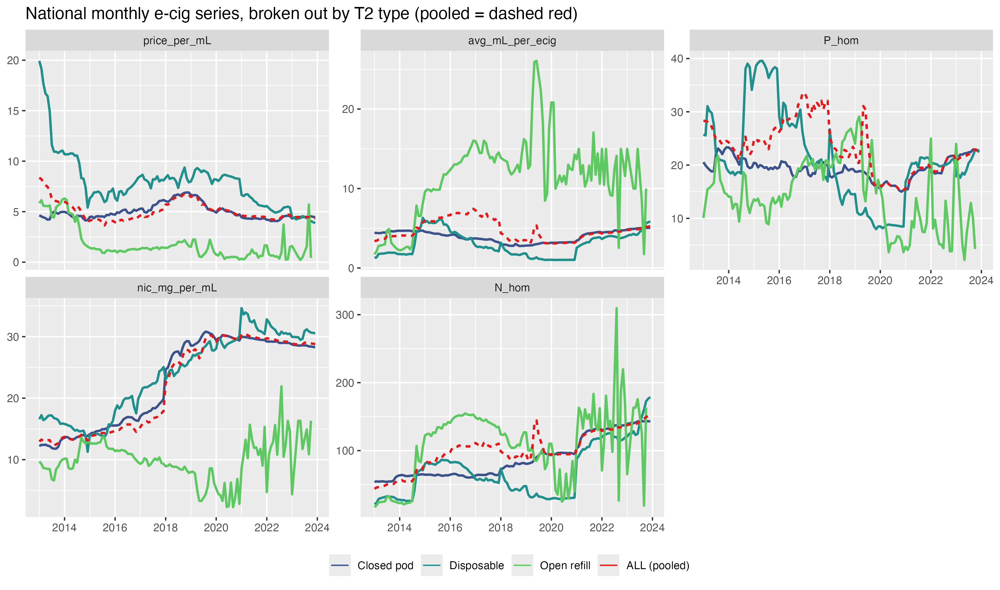
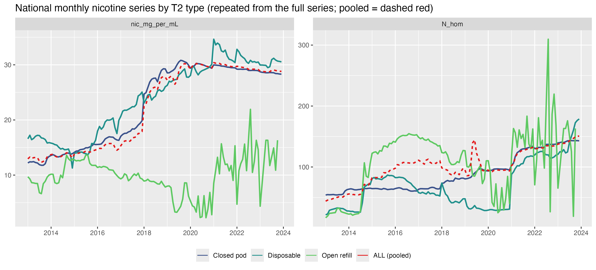
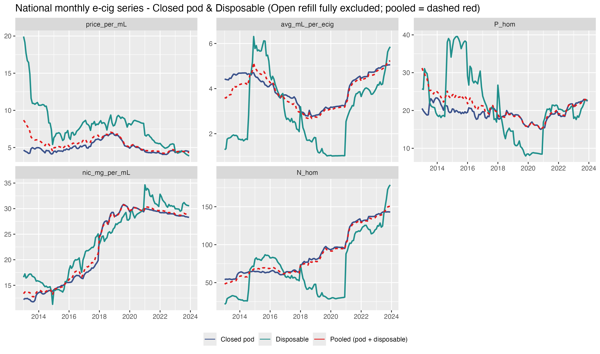
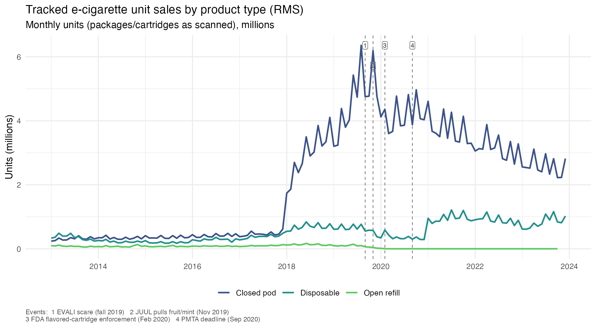
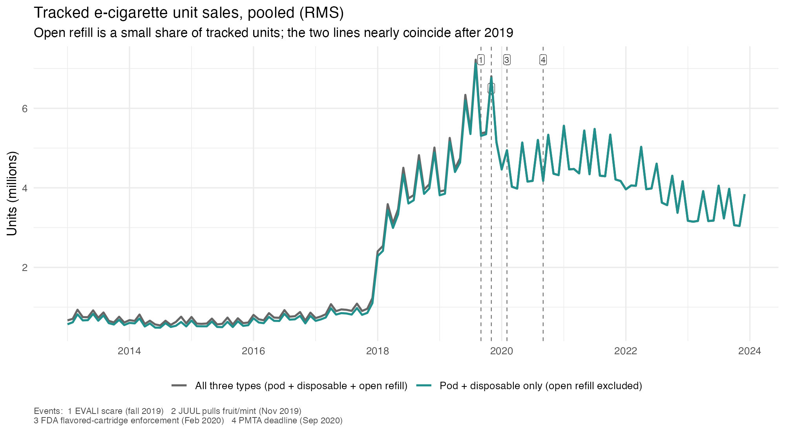
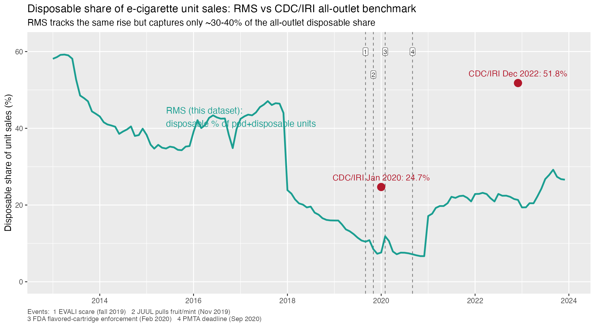
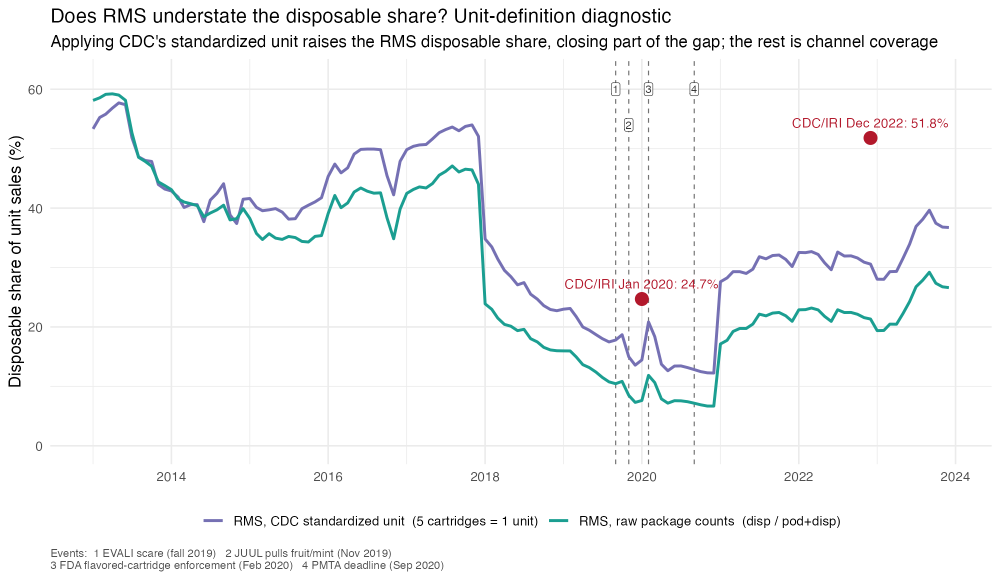

## 1. The three e-cigarette product types

E-cigarettes ("vapes") deliver nicotine by using a battery-powered heating element to turn a liquid solution (e-liquid) into an aerosolized vapor. They differ mainly in who sets the nicotine level and whether the device is refilled, replaced, or thrown away. Three form factors cover essentially
the whole market:

- **Closed pod** — a reusable, rechargeable battery with a pre-filled, sealed pod
  that snaps on. The **manufacturer fixes the nicotine**; the user replaces the empty pod
  rather than refilling it. (E.g., JUUL, VUSE Alto, NJOY Ace.)
- **Disposable** — a single all-in-one sealed unit (battery and e-liquid in one body)
  used until spent and then thrown away. The **manufacturer fixes the nicotine**,
  typically near the ~5% ceiling. (E.g., older "cigalike" sticks; modern bars such as
  Puff Bar and Elf Bar.)
- **Open refill** — an open/refillable tank filled from bottled e-liquid, where the
  **user chooses and can vary (and step down) the nicotine**. (E.g., refillable
  tanks/mods and e-liquid bottles.)

 
<em>Left to right: <strong>closed pod</strong> (prefilled pod + reusable battery); <strong>disposable</strong> (all-in-one, single-use); <strong>open refill</strong> (refillable device + e-liquid bottle).</em>

| Type | Who sets the nicotine | Refill / disposal | Typical examples |
|---|---|---|---|
| Closed pod | Manufacturer (fixed) | Snap in a new prefilled pod; recharge the battery | JUUL, VUSE Alto, NJOY Ace |
| Disposable | Manufacturer (fixed, ~5%) | None — use once, then throw the whole unit away | Puff Bar, Elf Bar; older cigalikes |
| Open refill | User (variable) | Refill the tank from an e-liquid bottle | Refillable tanks/mods, bottled juice |

This three-way split organizes the rest of the note: the summary statistics are built
from these types, and it is why nicotine is *manufacturer-set* for pods and disposables
but *user-set* for open refill.

## 2. Market concentration and brand composition over time

The set of brands selling in the tracked market turned over almost completely between
2013 and 2023.
The figure shows the annual brand composition of national mL sales — the top five
brands each year, with the market leader starred — and the table reports the leader,
runner-up, three-firm concentration (CR3), and the Herfindahl–Hirschman index (HHI).
Shares are **mL-weighted**.

: Annual concentration, mL-weighted brand shares (national).

| Year | Leader | Leader share | Runner-up | CR3 | HHI |
|---|---|---:|---|---:|---:|
| 2013 | BLU    | 56.0% | FINITI | 78.3% | 3519 |
| 2014 | BLU    | 35.0% | FINITI | 61.8% | 1869 |
| 2015 | MISTIC | 24.0% | BLU    | 55.5% | 1430 |
| 2016 | MISTIC | 25.9% | BLU    | 61.3% | 1564 |
| 2017 | MISTIC | 20.8% | BLU    | 56.0% | 1430 |
| 2018 | JUUL   | 46.9% | VUSE   | 67.7% | 2612 |
| 2019 | JUUL   | 42.3% | NJOY   | 77.0% | 2609 |
| 2020 | JUUL   | 33.7% | VUSE   | 87.3% | 2639 |
| 2021 | VUSE   | 43.7% | JUUL   | 87.7% | 2966 |
| 2022 | VUSE   | 50.5% | JUUL   | 87.9% | 3338 |
| 2023 | VUSE   | 54.8% | JUUL   | 86.8% | 3553 |

Concentration is **U-shaped** on the HHI (0–10,000 scale; 1,500 and 2,500 are the DOJ
moderately-/highly-concentrated thresholds):

- **2013 (BLU era).** BLU holds ~56% of tracked mL; HHI ~3,500–4,000 — highly concentrated.
- **2014–2017 (fragmentation).** No brand exceeds ~26%; HHI falls to ~1,400–1,600, near
  the moderately-concentrated floor.
- **2018–2020 (JUUL).** JUUL re-concentrates the market; HHI back above 2,500, leader
  share ~47% (2018).
- **2021–2023 (VUSE/JUUL duopoly).** VUSE overtakes JUUL; the top two hold ~88% of
  tracked mL (CR3 ≈ 87%) and HHI climbs to ~3,550 — highly concentrated again.

### Entry, exit, and ownership

The leadership turnover is largely a story of **corporate ownership and distribution**,
not of standalone product quality. The tracked market is dominated by brands owned by
the major tobacco companies, whose convenience-store and gas-station reach is exactly
the channel Nielsen RMS measures.

| Brand | Ownership / key corporate event | Trajectory in tracked mL |
|---|---|---|so bl
| BLU | Lorillard acquired (Apr. 2012) ; divested to Imperial Brands (2015) | 2013 leader (~56%) → ~8% (2018) → negligible |
| 21st Century Smoke | independent value cigalike | top-5 in 2013 (~9%) → exits by ~2015 |
| FINITI | early independent brand | ~13% (2013) → exits mid-decade |
| MISTIC | Ballantyne Brands (cigalike + bottled juice) | 24–26% (2015–16) → ~4% (2018) → gone by ~2020 |
| MarkTen | **Altria** (Nu Mark) | ~10% (2018) → discontinued 2018 |
| LOGIC | **Japan Tobacco** (acquired 2015) | steady but small; menthol focus |
| NJOY | independent (bankrupt 2016, relaunched) → **Altria** (acquired Jun 2023, ~\$2.75B) | #2 in 2019 (~24%) → #3 behind VUSE/JUUL |
| JUUL | independent; **Altria** 35% stake (Dec 2018, \$12.8B; exited 2023) | leader 2018–20 (peak ~47%) → declining #2 |
| VUSE | R.J. Reynolds Vapor → **British American Tobacco** (BAT acquired Reynolds American, 2017) | leader 2021–23 (44%→55%) |

**The cigalike incumbents fade (2013–2015).** In 2013 the market was BLU — a Lorillard
brand — at ~56% of tracked mL, with a long tail of first-generation "cigalike" and
bottled-juice brands (FINITI, NJOY, 21st Century Smoke). Cigalikes delivered low, harsh
nicotine and a weak experience; as the category grew, better hardware (tanks, then
salt-nicotine pods) displaced them, and the smaller value brands — without capital or
distribution — exited first. **21st Century Smoke** and **FINITI** fall out of the top
ranks by ~2015. BLU itself changed hands: when Reynolds American acquired Lorillard in
2015, blu was **divested to Imperial Brands** as an antitrust remedy; under Imperial it
never fielded a competitive salt-nicotine pod, and its share bled away through the JUUL
era.

**MISTIC and the open-refill niche (peak 2015–2017, gone by ~2020).** MISTIC (Ballantyne
Brands) rose to the *overall* market lead in 2015–2017 (~21–26% of all mL) on the
strength of **bottled e-liquid and cigalikes** — but that niche was precisely what JUUL's
high-nicotine closed pods made obsolete for mainstream users. Lacking a competitive pod,
MISTIC collapsed to ~4% by 2018; the two-month liquidation of discontinued 30 mL Mistic
bottles visible in the price series (§5) marks the wind-down. MISTIC's mid-decade
"leadership" is an open-refill phenomenon — among closed pods and disposables it was
never the leader (§5).

**JUUL's rise and fall (2018–2023).** JUUL Labs' salt-nicotine pod created the modern
category and took the tracked lead in 2018 (~47% of mL, and a far higher share of the
national market than tracked retail alone shows). **Altria bought a 35% stake in JUUL in
December 2018 for \$12.8 billion**, discontinuing its own MarkTen brand (Nu Mark) in the
process — which is why MarkTen appears at ~10% in 2018 and then vanishes. JUUL's decline
was **regulatory and legal**, and it struck JUUL's flavored-pod core directly: the 2019
EVALI scare and youth-vaping backlash, JUUL's own withdrawal of fruit and mint flavors
(November 2019), the February 2020 FDA enforcement priority against flavored cartridge /
pod products, a wave of state and youth-marketing lawsuits and multi-billion-dollar
settlements, and an FDA marketing denial order in June 2022 (quickly stayed pending
review). Altria wrote its stake down toward zero and exited in 2023.

**Why VUSE won — and why it beat NJOY.** VUSE is R.J. Reynolds Vapor's brand, and
**British American Tobacco** acquired Reynolds American outright in 2017. VUSE's ascent
to the tracked lead (44%→55% of mL, 2021–2023) rests on three things, in rough order of
importance: (i) **distribution and trade marketing** — BAT/Reynolds' dominance of
convenience and gas retail, price promotions, and shelf placement, i.e. exactly the
tracked channel RMS measures; (ii) **timing** — the VUSE Alto pod system (2018) arrived
just as JUUL's regulatory troubles began, so VUSE absorbed the pod demand JUUL shed; and
(iii) **regulatory legitimacy** — VUSE Solo received the first FDA PMTA marketing-granted
order (October 2021), which helped retain distributor confidence and shelf space while
rivals faced denials. NJOY had a comparable pod (Ace) and even early FDA authorization
(2022), but as an **independent** it lacked BAT-scale distribution and capital; it stayed
a distant third until **Altria acquired it in June 2023 (~\$2.75 billion)** after exiting
JUUL. So "VUSE > NJOY" is essentially *Big-Tobacco distribution + earlier momentum +
earlier authorization* versus *an under-resourced independent* — the parent company, not
the pod hardware, is the difference.

**Reading these shares.** They are mL shares in *tracked retail* (Nielsen RMS); industry
commentary often cites dollar share over broader channels. The direction agrees, but two
caveats matter. First, the modern disposable entrants (Puff Bar, Elf Bar, Lost Mary) that
reshaped the category after 2020 are undercovered here (Appendix B), so the VUSE/JUUL "duopoly"
is a *tracked-retail* phenomenon; in all-channel terms disposables loom much larger.
Second, the corporate facts above are widely reported but should be verified against
primary sources (company filings, FDA marketing orders, court records) before citation.

## 3. Constructing the representative price and nicotine series

For the summary statistics shown here, a representative e-cigarette **price** and
**nicotine content** are constructed for each state-month from **mL (e-liquid)
sales-weighted** brand aggregates. The representative price is

$$
p_{ms} = \big(\text{avg.\ price per mL}\big)_{ms} \times \big(\text{avg.\ e-liquid
capacity}\big)_{ms},
$$

with both averages taken under mL sales weights — the object denoted $P_{\text{hom}}$.
Writing $u_i$ for units and $m_i$ for mL per unit of product $i$,

$$
p_{ms} = \Big(\tfrac{\text{revenue}}{\text{mL sold}}\Big)\times \bar m,
\qquad
\bar m = \frac{\sum_i u_i m_i^2}{\sum_i u_i m_i},
$$

where $\bar m$ is average product size weighted by mL sold. The representative nicotine
content is the analogous mL-weighted object, $N_{\text{hom}}$: nicotine per unit is
built as $\text{mg/mL}\times\text{mL}\times\text{units}\times 0.68$ transfer efficiency
and then mL-weighted across products.

Because both objects are mL-weighted brand aggregates, **who sells the tracked
e-cigarette — and how that composition turns over (§2) — determines what the
representative product actually is in each period.** The price and nicotine series
themselves follow in §4, and the disposable-coverage caveat in Appendix B.

## 4. What drives $p_{ms}$ and the representative nicotine, period by period

**2013–2015 (cigalikes).** blu/NJOY/Logic cigalikes and bottled juice dominate
tracked retail; price per mL falls (~\$8→\$5) as bulk-juice competition intensifies;
nicotine is modest, so $p_{ms}$ is high-ish but the representative nicotine flow is
low.

**2016–2017 (nicotine salts).** JUUL commercializes salts, making ~5% nicotine
palatable in 0.7 mL pods. The representative concentration climbs steeply while
average capacity $\bar m$ falls as small pods displace cartridges; the representative
nicotine flow rises.

**2018–2019 (JUUL, and one caveat for $p_{ms}$).** JUUL becomes the largest brand by
mL; representative concentration peaks (~34 mg/mL, 2019–20). Two notes on the
series: (i) the fall-2019 EVALI scare temporarily depressed e-cig demand; and (ii) a
**spurious mid-2019 bump** in the *pooled* $p_{ms}$ and nicotine is a two-month
liquidation of discontinued 30 mL open-refill bottles (Mistic/HAUS, Cosmic Fog) whose
recorded price fell from ~\$25 to ~\$2.69 (verified in the raw Nielsen price field).
Because those bottles are large in mL, the mL-weighted $\bar m$ jumps (~3.7→5.2),
lifting $p_{ms}$ **even though price per mL and the average unit price both fell**. It
is real in the data but a *composition/weighting* effect; it is state-specific and
small, but it enters the state-month $p_{ms}$ where open refill had share.

**2020 (regulation splits the market).** The Feb 2020 FDA enforcement priority on
flavored *cartridge* ENDS exempted disposables; flavored volume migrates to
disposables; pod nicotine plateaus (see the timeline in §6).

**2021–2023 (modern disposables).** Within closed pods, price is stable and nicotine
keeps rising, now more via capacity than concentration; within disposables, nicotine
surges via *size* (5–6 mL units). But see Appendix B — disposables are a minority of the
tracked volume, so $p_{ms}$ remains pod-dominated.

The pooled endpoint decomposition (2013→2023) is robust to all data corrections:
$\Delta p_{\text{hom}}\approx-\$5.7$ (price/mL $-13.7$, size $+15.4$) and
$\Delta N_{\text{hom}}\approx+80$ mg (concentration $+37$, size $+23$).

The two nicotine measures are repeated below on their own axes for readability — the
same series as the two nicotine panels of the figure above.

## 5. The same series excluding open refill

The pooled series in §4 include all three product types, and open refill is the
noisiest of them: it is a thin sliver of tracked volume (bottled e-liquid and open
tanks, sold largely through channels the scanner panel captures poorly), so a single
clearance event or a few large-bottle SKUs can swing its mL-weighted averages — the
mid-2019 artifact is exactly such an episode. Because the "closed" products — closed
pods and disposables — are the focus, it is useful to view the series with open refill
fully excluded. In this view the pooled line is **pod + disposable only**.

A note on brand composition, connecting to §2. MISTIC leads the *all-types* market in
2015–2017 (~21–26% of all mL), but MISTIC is ~75–88% **open refill** — bottled juice —
so it is largely absent from the pod+disposable series here. Excluding open refill, the
closed-product leaders through 2017 are the cigalike incumbents: BLU (61%→26% of
pod+disposable mL, 2013→2017), then LOGIC rising to second (14→20%), with 21st Century
Smoke, FINITI, and NJOY filling in. This is why the closed-product view names Logic
rather than MISTIC — MISTIC's leadership is a bottled-juice phenomenon the closed series
does not see.

Period by period, for the pod+disposable pooled series ($P_{\text{hom}}$ in real \$,
$N_{\text{hom}}$ in mg):

- **2013–2015 (cigalike closed pods + old disposables).** BLU-led cigalikes dominate;
  price/mL falls from ~\$7.0 to ~\$5.1, nicotine is modest (~13→15 mg/mL), capacity
  $\bar m$ is ~3.9–4.7 mL. $P_{\text{hom}}$ eases ~27→24, $N_{\text{hom}}$ rises ~49→68.
- **2016–2017 (salts begin, pods shrink).** LOGIC climbs to second; nicotine
  concentration rises (14.6→19.4 mg/mL) while capacity falls (4.7→3.3 mL) as small pods
  displace big cartridges. $P_{\text{hom}}$ ~24→20; $N_{\text{hom}}$ dips slightly
  (~68→64) because capacity falls a touch faster than concentration climbs.
- **2018–2019 (JUUL).** JUUL takes 51% then 44% of pod+disposable mL; concentration
  jumps (19.4→28.9 mg/mL) and capacity collapses to ~2.8–3.0 mL (0.7 mL JUUL pods);
  $N_{\text{hom}}$ 64→86. Crucially, with open refill excluded there is **no mid-2019
  bump** — the spurious pooled-series blip in §4 was entirely an open-refill clearance
  artifact, and it vanishes here.
- **2020 (regulation splits the market).** JUUL still leads (34%) but VUSE closes to
  28%; nicotine plateaus (~29 mg/mL), capacity begins rising again; $N_{\text{hom}}$
  ~93. See the timeline in §6.
- **2021–2023 (VUSE/JUUL duopoly, modern disposables).** VUSE leads (44%→55%), JUUL
  second; capacity rises sharply (3.2→5.0 mL) as 5–6 mL modern disposables grow;
  concentration eases (29→23 mg/mL) but $N_{\text{hom}}$ keeps climbing (93→115) because
  size rises faster than concentration falls; price/mL settles near \$4.4 and
  $P_{\text{hom}}$ recovers ~16→22.

The endpoint decomposition is robust to excluding open refill: 2013→2023,
$\Delta P_{\text{hom}}\approx-\$5.2$ (vs $-\$5.7$ pooled-with-open) and
$\Delta N_{\text{hom}}\approx+66$ mg (vs $+80$ pooled-with-open) — the same sign and
story.

## 6. Timeline of regulatory and market events

The following events provide context for the 2019–2020 shifts in the series above; the
numbered dashed lines in the Appendix figures (tracked volume and disposable share)
mark them.

- Fall 2019: the EVALI outbreak (peaked August–September 2019), linked mostly to
  illicit THC/vitamin-E-acetate products rather than nicotine pods, temporarily
  depressed nicotine e-cigarette demand.
- September 2019: the administration announced its intent to clear flavored
  e-cigarettes from the market; JUUL voluntarily pulled its fruit and mint flavors in
  November 2019.
- January 2, 2020: the FDA finalized its "Enforcement Priorities for ENDS" guidance.
- February 6, 2020: the enforcement priorities took effect, prioritizing action against
  flavored (other than tobacco and menthol) prefilled cartridge / pod ENDS. Open-system
  e-liquids and disposables were not covered, so flavored disposables (Puff Bar, later
  Elf Bar) were exempt and flavored volume migrated to them.
- September 9, 2020: the premarket tobacco application (PMTA) deadline — products had to
  have submitted applications to remain legally marketed. Many modern disposables are
  imports without granted PMTAs, which is part of why they sell through channels the
  scanner panel captures poorly.

## Appendix A. Tracked sales volume (units)

The trends above work in shares and in price/nicotine intensities; the figures below
give the underlying denominator — total tracked unit sales — so the shares can be read
in context. Units are packages/cartridges as scanned (see Appendix C, the unit-definition
caveat, regarding cross-source comparisons).

Two features stand out: the ~2018 step up in closed-pod units (the JUUL takeoff), and
the post-2020 re-emergence of disposables. Open refill is small throughout and falls to
near zero after 2020.

Pooling confirms that open refill contributes little to tracked *unit* volume: the
all-three-types line and the pod+disposable-only line nearly coincide, especially after
2019. The tracked market is overwhelmingly a closed-product (pod, then pod+disposable)
market by units.

## Appendix B. Disposables are under-represented in RMS

The representative $p_{ms}$ is mL-weighted and therefore pod-dominated, partly because
disposables are a small share of *tracked* volume: ~24% of units and ~17% of mL even
in 2023. Benchmarking against the CDC/IRI all-outlet series shows the gap.

: Disposable share of unit sales (disposable / (pod + disposable)).

| | Jan 2020 | Dec 2022 |
|---|---:|---:|
| CDC/IRI (all-outlet) | 24.7% | 51.8% |
| RMS (this dataset)   | 7.4%  | 21.3% |

The CDC MMWR (IRI retail-scanner data) reports the disposable unit share rising from
**24.7% to 51.8%** over Jan-2020→Dec-2022 — disposables became the market majority —
while the RMS series shows the same *direction and timing* at ~30–40% of the *level*.
The gap is a post-2020, **modern-disposable** phenomenon: those brands (Puff Bar, Elf
Bar, Breeze, Lost Mary) sell heavily through vape shops, specialty/convenience, and
online, and are largely **imports without granted PMTAs** — sales channels scanner
panels capture poorly (and even IRI excludes vape shops/online). The representative
e-cigarette in these series is therefore the *tracked-retail, pod-weighted*
e-cigarette, with the disposable share a lower bound. This also bears on §2: the
VUSE/JUUL concentration is a tracked-retail duopoly, and the (mostly unbranded-to-RMS)
disposable wave is exactly the heterogeneity the tracked panel misses.

## Appendix C. The low RMS disposable share: unit-definition vs. channel coverage

The RMS disposable share in Appendix B sits well below the CDC/IRI benchmark. Two things
could drive that: (i) a *unit-definition* difference — the CDC/IRI series standardizes
**1 unit = 5 prefilled cartridges = 1 disposable device = 1 e-liquid bottle** (Ali et
al. 2023), whereas the raw scanner-package series (Appendix B) counts a multi-pod pack
as one "unit" against one disposable; and (ii) genuine *channel* undercoverage.
The figure isolates (i) by recomputing the RMS disposable share under CDC's standardized
unit — closed-pod cartridges ÷ 5, one unit per disposable and per e-liquid bottle — and
including e-liquid in the denominator to match CDC's three categories. This
standardization is a comparability diagnostic only; the series shown elsewhere in this
note use the raw counts.

The standardized definition raises the RMS disposable share materially — from 7.4% to
14.3% in January 2020, and from 21.3% to 30.6% in December 2022 — closing roughly 30–40%
of the gap to the CDC/IRI points (24.7% and 51.8%). The residual gap (14.3 vs 24.7;
30.6 vs 51.8) is what channel coverage explains: IRI captures convenience/gas/dollar/
military outlets that carry disposables heavily, and both IRI and RMS exclude vape shops
and online, where modern disposables concentrate. So the low RMS disposable share
reflects two compounding causes — the unit convention and outlet coverage — and even the
standardized RMS share remains a lower bound on the true all-channel figure.
