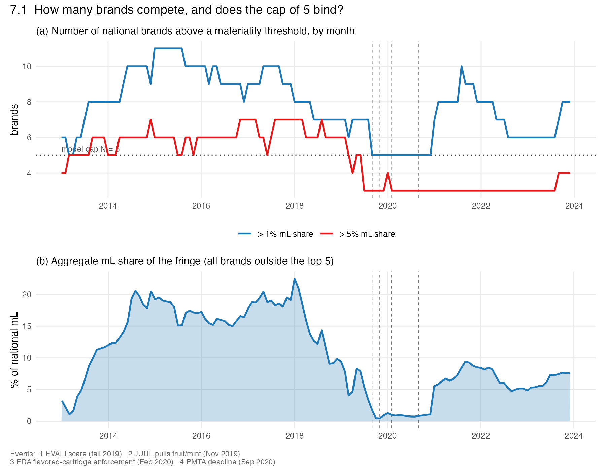
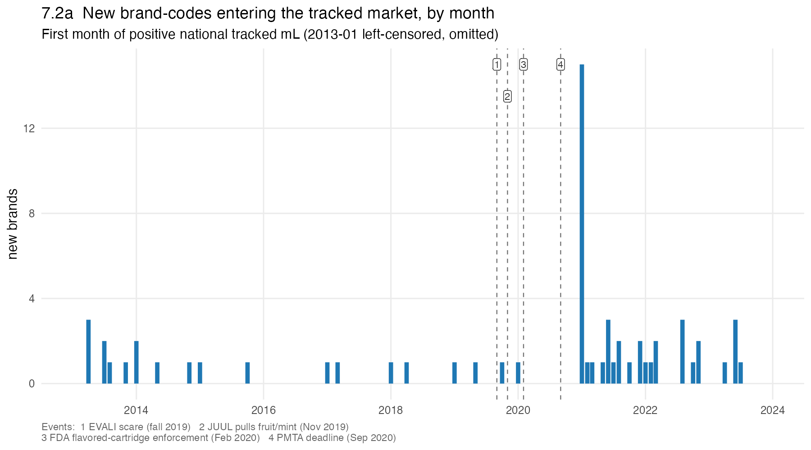
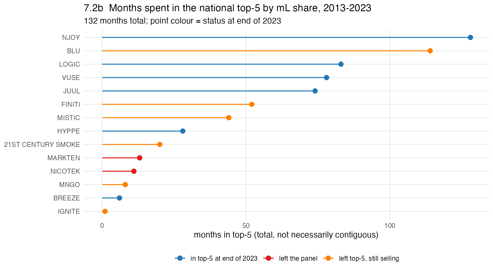
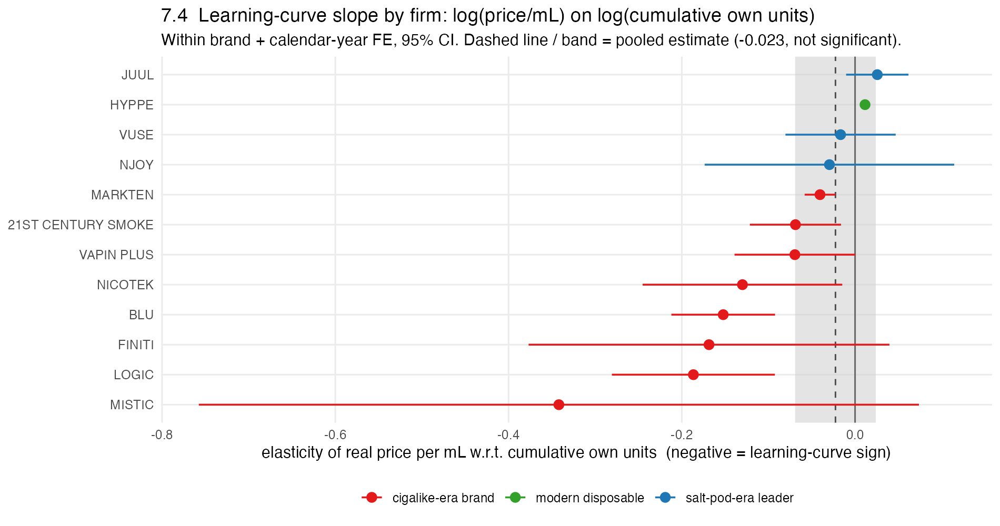
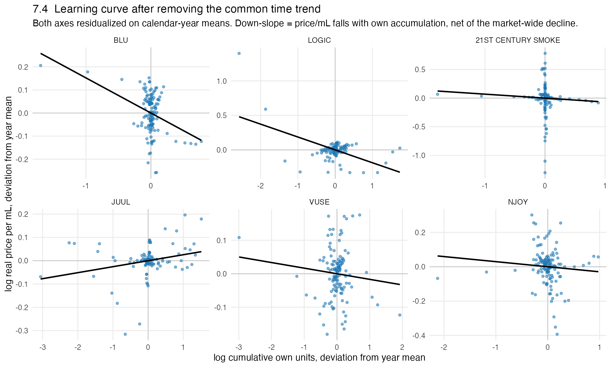
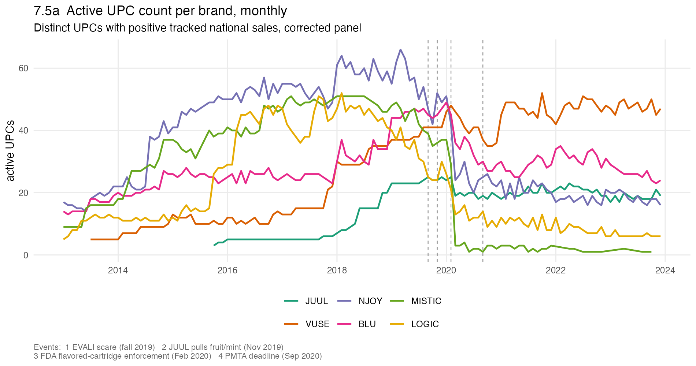
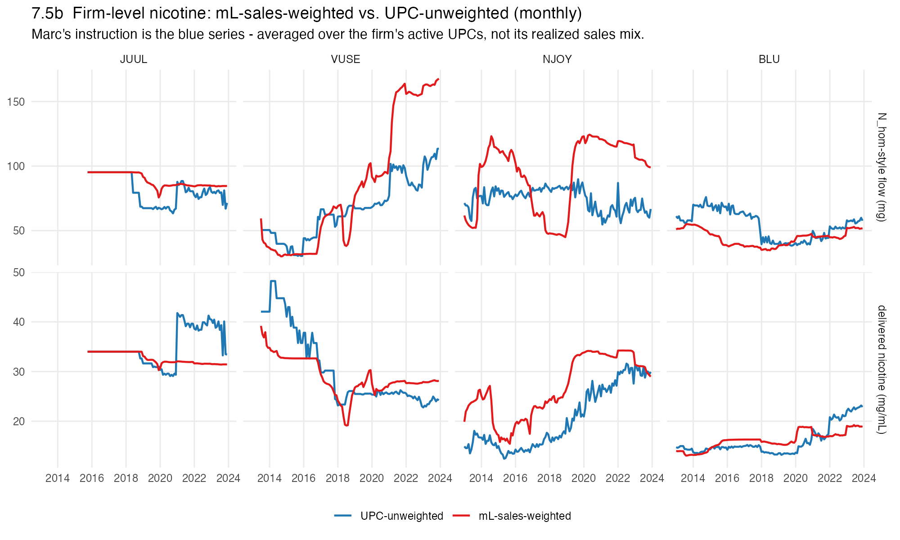

## 1. What this note does

The Aug 27 model note (§7) lists six statistics to pull from the Nielsen RMS panel
before locking down functional forms for the Experience-Based Equilibrium (EBE)
supply model. This note answers four of them — 7.1 (does the cap of five firms
bind), 7.2 (entry/exit hazards), 7.4 (a learning-by-doing cost signature), and 7.5
(product-offering-set dynamics and a nicotine-weighting check). Items 7.3
(nicotine vs. FDA event study) and 7.6 (ownership vs. own-quality as the driver of
turnover) are deferred and are not addressed here.

Everything is national and monthly (§6.5 of the model note), built from the
corrected-nicotine panel — `bt_month_t2_niccorr_from_full.RData` for the
brand-month series (7.1, 7.2, 7.4) and a matching UPC-month build for 7.5. The
`UNKNOWN` residual bucket (~1.9% of tracked mL, un-attributed to a brand) is
dropped from every firm count, entry/exit statistic, and regression. Where a
statistic needs a weight, the demand-side notes use mL-sales weights; per Marc's
instruction the firm-level nicotine *state* in 7.5 is instead built
UPC-unweighted, and the note shows both.

The same data-quality caveats that run through the two 08_05_2026 notes apply here
and are flagged in place: the mid-2019 open-refill clearance artifact, and the
post-2020 undercoverage of modern disposables (Puff Bar, Elf Bar, Breeze, Lost
Mary) that sell mainly through vape shops and online. The second one matters most
for 7.2 — a large part of the 2021 "entry" wave is the scanner panel starting to
capture brands that were already selling elsewhere, not genuine de novo entry.

Figures and the underlying CSVs are in
`output/prelim_analysis/firm_dynamics_ebe/`; the code is
`code/analysis/10_ebe_diagnostics.R` and `code/build/5_build_upc_month_niccorr.R`.

## 7.1  How many brands compete, and does the cap of five bind?

In the median month, 22 brands record positive tracked mL (range 12–39), **8**
hold more than 1% of national mL (range 5–11), and **5** hold more than 5% (range
3–7). More than five brands clear the 1% bar in **114 of 132 months** (86%), and
more than five clear the 5% bar in **59 of 132 months** (45%).

The 5%-threshold count is strongly era-dependent, and this is the substantive
point. Through the fragmented 2014–2018 period, 6–7 brands routinely hold above 5%
each and the fringe below the top five carries 15–20% of national mL (peaking near
22% in 2018). The count then falls to **3** across 2020–2023 as the market
concentrates into the VUSE/JUUL/NJOY group, and the fringe collapses to about 1%
of mL in 2020 before recovering to 6–9% in 2021–2023 as tracked disposables
return. The only stretch where exactly five brands clear even the 1% bar is
2019–2020.

**Verdict.** Five is not a real cap on the number of economically active firms —
it is a reasonable description of the *concentrated* market from 2019 on, and a
clear undercount for 2014–2018. Two implications for the spec. First, if the
model is calibrated to the pod era (2019–2023), $\bar N = 5$ is defensible and the
fringe can plausibly be dropped or folded into the outside option. Second, if the
2013–2018 fragmentation is in the estimation sample, either $\bar N$ needs to be
larger or the sub-5% brands need to be modeled as a competitive fringe outside the
dynamic game — a 15–20% mL residual spread across 4–6 brands is not a rounding
error, and its share moves enough year to year (0.4% to 22%) that treating it as a
fixed constant would distort the pricing subgame.

## 7.2  Entry / exit hazards and the one-entrant-per-period assumption

**Entry (market-wide).** Sixty-three brand-codes first appear after January 2013,
spread across 35 distinct months, with up to 15 in a single month. The
distribution is very uneven: **27 of the 63 arrive in calendar 2021** alone (the
modern-disposable wave — Esco Bars, Fume, and similar), with another 10 in 2022.
Before 2021, entry is sparse — 7 new brands in 2013 as scanner coverage ramped,
then 0 to 4 per year through 2020 (and 0 in 2016). So "at most one potential
entrant per period" is a defensible approximation for the cigalike and pod eras
(2014–2020) but is decisively violated in 2021–2022. The caveat cuts in the model's favor: much of the 2021
spike is the scanner panel beginning to capture disposable brands that were
already selling through untracked channels (Appendix B of the brand-dynamics
note), so it overstates true de novo entry. If the estimation sample stops around
2020, the single-entrant assumption is close to the data; if it runs through 2023,
the entry process needs to allow a burst.

**Top-five tenure.** Fourteen brands reach the national top five by monthly mL
share at some point. The median brand spends **36 months** there (mean 47). Six
are still in the top five at the end of 2023 (NJOY, LOGIC, VUSE, JUUL, plus the
disposables HYPPE and BREEZE); NJOY is in the top five for 128 of the 132 months
(out only around its 2016 bankruptcy), and BLU accumulates 114 top-five months
before dropping out for good in mid-2022.

**Age at exit, and corporate events.** Eight brands leave the top five for good.
Age (months since first appearance) at the last top-five month is bimodal: quick
flame-outs of under-capitalized value brands — 21st Century Smoke (19 months),
Nicotek (23), and the one-month 2021 disposable blips MNGO (7) and Ignite (15) —
versus slow declines of former leaders — FINITI (51), MarkTen (65), MISTIC (77),
BLU (114). Cross-referencing the six exits with meaningful tenure against the
dated corporate events in the brand-dynamics note:

| Brand | Last top-5 month | Left panel | Dated corporate event | Read |
|---|---|---|---|---|
| MarkTen | Jan 2019 | Jul 2022 | Altria discontinued MarkTen, 2018 (after the Dec 2018 JUUL stake) | **coincides** — ownership decision, not competitive exit |
| MISTIC | Jun 2019 | trace to 2023 | Ballantyne wind-down ~2020; 30 mL bottle liquidation mid-2019 | **coincides** — strategic wind-down (and no competitive pod) |
| BLU | Jul 2022 | still selling | divested to Imperial, 2015 | **no coincidence** — the divestiture is 7 years earlier; this is a slow bleed |
| FINITI | Apr 2017 | Sep 2023 | none nearby | clean competitive exit |
| 21st Century Smoke | Aug 2014 | still selling | none nearby | clean competitive exit |
| Nicotek | Dec 2014 | May 2023 | none nearby | clean competitive exit |

Two of the six line up with a dated corporate event (MarkTen, MISTIC); the other
four look like state-dependent competitive decline — gradual for BLU, faster for
the small cigalike brands (FINITI, 21st Century, Nicotek). And the three largest *ownership*
shocks in the sample — BLU→Imperial (2015), Altria→JUUL (2018 in, 2023 out),
Altria→NJOY (2023) — produced **no** top-five exit near the event: JUUL and NJOY
are both still in the top five at the end of 2023, and BLU's ranking exit is
seven years after its divestiture.

**Verdict.** The exit side is a workable mix for the model: enough clean
competitive exits (FINITI, 21st Century, Nicotek, and the quick disposable
flame-outs) to identify a state-dependent exit rule, but a non-trivial minority
(MarkTen, MISTIC) where the exit is really a parent-company decision. Those two
are candidates to treat as exogenous ownership shocks rather than endogenous exit
draws. Note also that RMS brand-codes persist at trace volume long after the brand
stops being a going concern (MISTIC "sells" through 2023), so "left the panel" is
a soft date — the last-top-five month is the cleaner exit marker. This bears on
7.6 (deferred): the ownership-vs-quality question is live, but on the exit margin
specifically the competitive story is the more common one.

## 7.4  Is there a learning-by-doing cost signature?

The test regresses log real price per mL for firm $i$ in month $t$ on the log of
firm $i$'s cumulative own units sold through $t-1$, with brand fixed effects and a
time control. Price per mL is revenue over mL, not marginal cost, so this is a
reduced-form check for the classic learning-curve sign (own price falling as the
firm accumulates output, net of the market-wide trend), not a cost estimate.

**Pooled, there is no signature.** With brand and calendar-month fixed effects the
elasticity is **−0.023** (SE 0.024, not significant); with brand and year effects,
−0.024. Drop the time control and it goes to −0.085 (p < 0.001), but that
coefficient is just absorbing the well-documented market-wide decline in price per
mL (roughly \$8 to \$4.4 over the sample), not own-firm learning. Using cumulative
mL instead of units gives −0.038 (p = 0.14). So once the common time trend is
removed, cumulative own output does not predict a firm's price per mL in the pool.

**Firm by firm, it is a cigalike-era phenomenon.** Restricting to the 12 brands
that ever held at least 3% of national mL in a year and estimating within each
brand with year effects: every first-generation / cigalike-era brand has a
negative slope — MISTIC −0.34, LOGIC −0.19, FINITI −0.17, BLU −0.15, Nicotek
−0.13, 21st Century Smoke −0.07, MarkTen −0.04, several significant — while the
three salt-pod-era leaders are flat: NJOY −0.03, VUSE −0.02, JUUL **+0.03**, none
significant. The residualized scatter shows the same split visually: BLU, LOGIC,
and 21st Century slope down within year; JUUL slopes slightly up, VUSE and NJOY
are essentially flat.

**Verdict.** The "accumulated experience lowers cost" mechanism describes the
2013–2017 cigalike incumbents, whose price per mL fell as they scaled — but that
decline is also the period's bulk-juice price war, so it is partly a
demand/competition story rather than pure own-cost learning, and the two cannot be
separated with price data alone. For the pod-era leaders — the firms the EBE model
is actually built to explain — there is no learning-curve signature in price per
mL at all. If the endogenous state $a_{i,t}$ is meant to be a
cost-reducing experience stock, the data support giving it bite for the cigalike
cohort and little to none for JUUL/VUSE/NJOY, whose scaling came with flat or
rising price per mL. That argues for either a demand-side interpretation of
$a_{i,t}$ (experience shifts willingness-to-pay, not marginal cost) or a
cost channel identified from something other than price — margins, or input/PMTA
compliance costs — rather than the Benkard price-on-cumulative-output curve.

## 7.5  Product-offering-set (UPC count) dynamics and the nicotine-weighting check

This section uses a corrected brand × UPC × month panel built from the raw RMS
files with the same nicotine corrections as `bt_month_t2` (it collapses back to
`bt_month_t2` to machine precision — see the appendix). 1,483 e-liquid UPCs;
100–463 active nationally in a given month.

**(a) UPC count is not a clean state variable for market position.** The offering
set is *not* monotone in share. JUUL took the market lead in 2018–2019 (~47% of
national mL) while never carrying more than ~25 active UPCs — it won with a
deliberately narrow line. NJOY carries the fattest catalog throughout (peaking at
66 UPCs in 2019) and is a persistent #3. The one brand whose UPC count clearly
tracks its rise is VUSE, which is also the only incumbent whose catalog *grows*
after 2020 (from ~35 to ~52 as it takes the lead). And the single largest
movement in every incumbent's catalog is not a firm decision at all: the February
2020 flavored-cartridge enforcement (event 3) is a cliff — MISTIC's active UPC
count falls from ~37 to ~2 within two months, LOGIC's from ~30 to ~12, NJOY's from
~50 to ~20, BLU's from ~48 to ~27.

**Lead-lag.** A distributed-lag regression of the monthly change in national mL
share (percentage points) on leads and lags of the change in log UPC count,
brand and month fixed effects, SEs clustered by brand: the contemporaneous
coefficient is **+0.44 (p = 0.06)** and the one- and two-month leads and lags are
all smaller (0.11–0.34) and individually insignificant, roughly symmetric in both
directions. Month-to-month, the two change series are essentially uncorrelated
pooled (|corr| ≤ 0.03 at every lag from −4 to +4); only JUUL shows a weak
persistent positive association. So at monthly frequency UPC-count growth and
share growth move *together*, with no robust lead or lag — the monthly
first-differences are too noisy to distinguish "expand the catalog, then gain
share" from simultaneity. The cleaner pattern is in the levels: catalogs tend to
build up through a brand's ascent and rationalize after its peak, consistent with
product-line breadth as a slow-moving investment, but the monthly data cannot
establish that it *precedes* the demand payoff.

**Verdict for 7.5a.** UPC count is a poor proxy for the endogenous state
$a_{i,t}$: it is non-monotone in market position (JUUL is the decisive
counterexample), and its biggest swings are a common regulatory shock (Feb 2020),
not firm choices. It is better used as a control or a secondary observable than as
the state itself.

**(b) The weighting choice is not innocuous.** Across JUUL, VUSE, NJOY, and BLU,
the mL-sales-weighted and UPC-unweighted delivered-nicotine series have a mean
absolute gap of **3.9 mg/mL** (correlation 0.84) — roughly 15% of the level, and
much more for some brands. The gap is systematic, not noise:

- **NJOY**: mL-weighted delivered nicotine runs at ~33–34 mg/mL in 2019–2023
  while the UPC-unweighted average of its active line is ~21–28 — a 6–12 mg/mL gap,
  because NJOY's sales concentrate in a few high-nicotine pods while its catalog
  carries many lower-nicotine SKUs. On the $N_{\text{hom}}$-style flow the gap is
  even wider (mL-weighted ~120 vs UPC-unweighted ~75 in 2020–2022), and the two
  measures diverge sharply in 2014–2016.
- **VUSE**: the UPC-unweighted series is *higher* early (2013–2014: ~42 vs ~34
  mg/mL) and lower later; the mL-weighted $N_{\text{hom}}$ flow reaches ~160 mg by
  2022 versus ~100 for the UPC-unweighted line.
- **JUUL**: the two track closely while the line is narrow (2015–2018), then
  diverge — 2021–2023 UPC-unweighted mg/mL rises to ~40 while mL-weighted stays
  ~32, as JUUL's catalog tilts to 5% SKUs faster than its sales mix does.
- **BLU**: the two series stay within ~1–2 mg/mL through 2020, then the
  UPC-unweighted line runs ~3–4 mg/mL higher in 2021–2023.

**Verdict for 7.5b.** Marc's instruction matters. For the two brands the model
most needs to get right — VUSE (eventual leader) and NJOY (persistent #3) — the
choice between mL-sales weights and UPC-unweighted averaging moves the firm-level
nicotine state by 30–50% and can reverse the sign of its change in some periods.
The UPC-unweighted series is also the conceptually correct one for a supply-side
state: it is a property of the firm's posted product line, not of the current
month's realized demand. Recommendation: build $a_{i,t}$ (or its nicotine
component) from the UPC-unweighted series, and keep the mL-weighted series only as
the object that feeds the demand side.

## 8. What this changes in the model spec

Pulling the four diagnostics together, against the open choices in §6 of the model
note:

- **$\bar N = 5$ and the fringe (7.1).** Fine for a pod-era calibration
  (2019–2023). For a sample that includes 2013–2018, either raise $\bar N$ or add
  an explicit competitive fringe — the sub-top-5 mL residual is 15–20% then and
  time-varying.
- **Entry process (7.2a).** One-entrant-per-period is close to the data through
  2020 and broken in 2021–2022; a sample ending ~2020 keeps the assumption clean,
  a longer one needs an entry burst (and should treat the 2021 disposable inflow
  as partly a coverage change, not pure entry).
- **Exit process (7.2b/c).** Enough clean competitive exits to identify a
  state-dependent exit rule; carve out MarkTen and MISTIC as parent-company
  (exogenous) exits. Ownership changes at going concerns (JUUL, NJOY) did not
  cause exit and should not be modeled as exit shocks.
- **The cost channel / $a_{i,t}$ (7.4).** No learning-curve price signature for
  the pod-era leaders. If $a_{i,t}$ is a cost-reducing stock, it mostly describes
  the cigalike cohort. Consider a demand-side reading of $a_{i,t}$, or identify
  the cost channel off something other than price per mL.
- **UPC count as the state (7.5a).** Don't. Non-monotone in share (JUUL: narrow
  line, market leader), and its largest moves are the Feb 2020 regulatory catalog
  cull. Use it as a control, not as $a_{i,t}$.
- **UPC-unweighted vs. mL-weighted nicotine (7.5b).** Build the firm-level
  nicotine state from the UPC-unweighted series, per Marc. The gap to the
  mL-weighted version averages ~3.9 mg/mL and is 30–50% for VUSE and NJOY — large
  enough that it is a real modeling choice, not a normalization.

## Appendix. Data and construction

- **Panel.** `smoke_firm_dir/input/bt_month_t2_niccorr_from_full.RData`
  (brand × type × month, corrected nicotine, 2013-01 to 2023-12, 132 months) for
  7.1/7.2/7.4; `smoke_firm_dir/input/upc_month_niccorr_from_full.RData`
  (brand × UPC × month, built by `code/build/5_build_upc_month_niccorr.R` with the same
  row-level corrections, validated by collapsing back to the brand-type panel)
  for 7.5.
- **Brand universe.** 76 brand-codes; `UNKNOWN` (1.9% of mL) dropped from all
  firm-level statistics.
- **Firm counts (7.1).** Shares are mL-based, computed each month over all
  identified brands.
- **Entry (7.2a).** First month a brand-code has positive national tracked mL;
  January 2013 is left-censored (all incumbents "appear" then) and dropped.
- **Top-five tenure (7.2b).** Rank by monthly national mL; "months in top-5" is
  total, not necessarily contiguous; "age at last top-5 month" is months since
  first appearance.
- **Learning regression (7.4).** `feols(log(price_per_mL) ~ log(cum_units) |
  brand + ym)`, cumulative own units through $t-1$, SEs clustered by brand;
  firm-by-firm version uses calendar-year FE within brand, restricted to the 12
  brands that ever held ≥3% of national mL in a year.
- **UPC count / nicotine (7.5).** Active UPC = distinct `upc12` with positive
  national units that month. UPC-unweighted nicotine = equal-weight mean of each
  active UPC's own delivered mg/mL (and, for the flow measure, mean mL per unit)
  across the firm's line. Lead-lag: `feols(d_share_pp ~ l(d_log_upc, -3:3) |
  brand + month)`, clustered by brand.
- **Known artifacts flagged in place.** Mid-2019 open-refill clearance; post-2020
  modern-disposable undercoverage; the Feb 2020 flavored-cartridge enforcement as
  a discrete catalog cull; RMS brand-codes persisting at trace volume after a
  brand is effectively gone.
- **Files.** Code: `code/analysis/10_ebe_diagnostics.R`,
  `code/build/5_build_upc_month_niccorr.R`. Figures and CSVs:
  `output/prelim_analysis/firm_dynamics_ebe/`.
