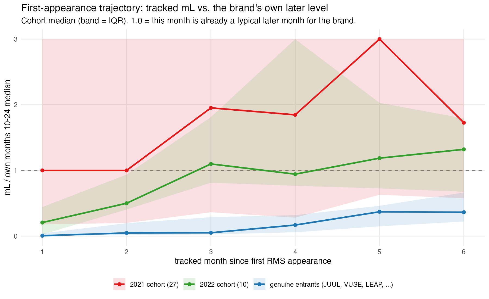
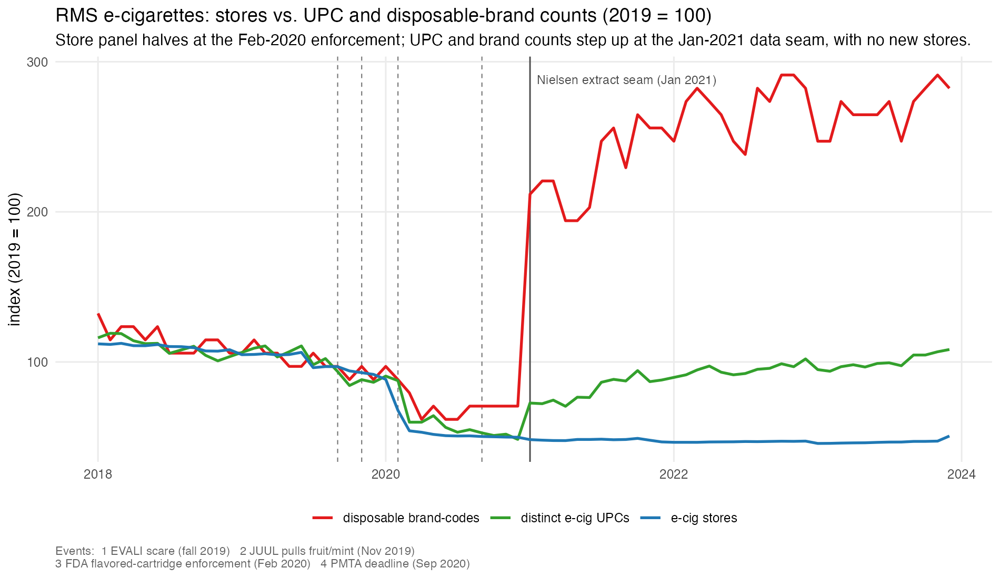

## 1. What this note does, and the bottom line

Diagnostic 7.2a found that of the 63 brand-codes with a first tracked-sales month
after January 2013, **27 arrive in calendar 2021** — against a background rate of
0–7 per year in every other year — and hypothesised that this is mostly the RMS
panel starting to see modern disposable brands that were already selling through
channels it covers poorly, not genuine de novo entry. This note checks that
against the data on five margins. The fringe's entry process in the model depends
on the answer: a coverage/taxonomy artifact should be corrected out of the entry
margin, whereas genuine burst entry needs an arrival process that can produce a
burst.

**Bottom line.** The 2021 wave is **almost entirely a data-visibility event, not
economic entry** — and, importantly, *not* the "RMS started covering vape shops"
version of that story. The RMS store panel did **not** expand in 2021; it had
already contracted by ~half in early 2020 and kept shrinking. What changes at the
January 2021 seam is that the new Nielsen data delivery **resolves ~110 more
disposable UPCs and ~15 more brand-codes on the same (slightly smaller) set of
convenience/gas/drug stores**, with total tracked units essentially flat. The
products were physically on those shelves in 2020 — the panel just wasn't
attributing them to brands (the residual "UNKNOWN" bucket, ~0.3–0.6M mL/month
pre-2021, drops to zero in January 2021).

For the fringe process, split the 27 by *how* they appear, since both are
coverage but they need different handling:

- **~18–20 of 27 — step appearance / already at scale.** Brands that show up in
  January 2021 already spanning many states (MNGO in 34 states, Bidi in 21) at or
  above their eventual steady-state volume, most with documented pre-2021 market
  presence, several being the *same physical product* under multiple new codes
  (the Puff Bar family; Puur Vapor/Savage). These are not arrivals at all — treat
  as a one-time panel-onboarding event at January 2021.
- **~7–9 of 27 — coverage ramp.** Brands that also existed before 2021 (Hyppe,
  Hyde, HQD, Air Bar, …) but phase into the panel gradually over 2021 from a
  single state. The ramp is *coverage* diffusion, not *product* diffusion — still
  not economic entry, but it looks like entry in the series.
- **~0–2 of 27 — verifiably genuine de novo 2021 entry.** On the evidence here,
  essentially none of the 27 can be confirmed as a product that did not exist
  before 2021. The cleaner genuine-entry ramps are in the 2022 cohort (Esco Bars,
  Fume, Avata — single-state launches that build over months).

The timing seals it: **zero** new brand-codes appear in the ten months after the
February 2020 flavored-cartridge enforcement or the four months after the
September 2020 PMTA deadline, then **15 appear in January 2021**, exactly at the
seam where the RMS e-cig series switches Nielsen data deliveries
(`nielsen_extracts/RMS` → `2021-Onward_Scanner_Data/...`). Regulation-driven burst
entry would have shown up *in 2020*.

## 2. First-appearance trajectories: abrupt onset vs. diffusion ramp

For each brand, compare its tracked mL in months 1–3 of its RMS life against its
own later steady-state level (median mL over tracked-months 10–24). A genuine new
product ramps: month 1 is a small fraction of where it settles. An
already-established product entering measured channels appears at once near — or
above — its steady state.

| cohort | n | median (month-1 mL ÷ own later level) | median month-1 national mL share |
|---|---:|---:|---:|
| clean genuine entrants (JUUL '15, VUSE '13, Logic '13, MarkTen '13, LEAP '19) | 5 | **0.01** | ~0.00% |
| 2013 post-January cohort | 19 | 0.38 | 0.06% |
| 2019 cohort | 3 | 0.07 | 0.00% |
| **2021 cohort** | **27** | **1.00** | 0.00% |
| 2022 cohort | 10 | 0.21 | 0.00% |

The 2021 cohort's median brand records as much volume in its *first* tracked month
as in a typical later month — two orders of magnitude more front-loaded than a
genuine entrant, and well above even the (already coverage-affected) 2013 cohort.
Several 2021 entrants come in *above* their eventual level: Bidi (month 1 = 9×
later median), EPIC (21×), Dinner Lady (6×), Pop (4×), MNGO (3.6×), Switch Mods
(4.7×) — an unambiguous signature of a product that was already at scale and got
switched on, then partially settled as coverage stabilised. By contrast the 2022
cohort (Esco Bars, Fume, Avata, Stagbar, Savage) ramps far more gradually
(median 0.21), so 2022 entry already looks closer to real diffusion.

Within 2021 the picture splits by *shape*, not by genuine-vs-fake: abrupt onset
at or above steady state (Bidi, MNGO, Pop, Puur Vapor, EPIC, Dinner Lady, Switch
Mods, Helo, and most of the long tail) versus multi-month ramp from near zero
(Hyppe 0 → 4.3% peak, Ignite, HQD, Zeo, Pacha, Hyde). Both groups are made up of
products with pre-2021 market presence (§4); the ramp is the panel's coverage of
that brand improving gradually rather than the product diffusing.

## 3. Outlet coverage: did the store panel expand, or just the brand count?

No. The count of RMS stores selling e-cigarettes **fell** across the whole
relevant window, and the January 2021 brand-count jump happens on a *shrinking*
store base.

| month | e-cig stores | disposable-carrying stores | distinct e-cig UPCs | e-cig units |
|---|---:|---:|---:|---:|
| 2019 (mean) | 25,800 | 22,400 | 463 | 5.6M |
| 2020-01 | 22,802 | 17,167 | 419 | 4.6M |
| 2020-02 | 17,471 | 13,501 | 405 | 5.1M |
| 2020-03 | 13,963 | 11,958 | 277 | 4.1M |
| 2020-12 | 12,861 | 10,568 | **224** | 4.6M |
| **2021-01** | **12,450** | **11,328** | **336** | 5.7M |
| 2021-06 | 12,475 | 11,278 | 353 | 4.5M |
| 2022 (mean) | 12,087 | 11,194 | 439 | 4.2M |

Two things stand out. First, the store panel **collapses in February–March 2020**
(22,800 → 14,000 e-cig stores; distinct UPCs 405 → 277), exactly at the flavored-
cartridge enforcement — thousands of convenience outlets dropped the flavored SKUs
(this is the enforcement's footprint in the data, worth noting separately). It
keeps drifting down through 2021–2023. Second, across the December 2020 → January
2021 seam the store count goes **down** (12,861 → 12,450; 12,075 in both months,
375 new, 786 dropped — ordinary panel churn), while the distinct e-cig UPC count
jumps **+50% (224 → 336)** and disposable brand-codes go 9 → 25, with tracked
units flat. More products, more brands, fewer stores, same volume: that is a
resolution/attribution change in the data feed, not new outlet coverage.

Where the volume comes from is consistent with this: the residual **UNKNOWN**
brand bucket carries ~0.3–0.6M mL/month through 2020 and then reads **exactly
0.00 from January 2021 on**, as the new feed attributes everything to a named
brand; measured disposable volume steps from ~0.3M to ~1.5M mL/month at the same
instant.

The entrants' first-month geographic footprint is the useful discriminator for
§7. Brands appearing all-at-once across many states in month 1 — MNGO (34
states), Bidi (21), Dinner Lady (8) — are established products switched on.
Brands appearing in a single state and building — Hyppe, Hyde, HQD, Air Bar, and
the entire 2022 cohort (Esco Bars, Fume, Avata: 1 state each) — phase in, whether
because coverage of that brand improved gradually or because it was a real
regional launch.

## 4. Brand identity vs. documented launch dates

The RMS `product_descr` for essentially all 27 is the generic "SMOKING
ALTERNATIVE PRODUCT" / "ANTISMOKING PRODUCT" (Nielsen's post-PMTA disposable
label), but the brand-name field and UPC company prefixes identify the products,
and most correspond to brands with well-documented pre-2021 market presence:

| 2021 RMS entrant | product | documented market presence |
|---|---|---|
| BIDI | Bidi Stick (Kaival Brands, NASDAQ:KAVL) | launched 2019 |
| KOMGE / MR VAPOR / part of HYPPE | **Puff Bar / Puff Plus / Puff Flow** (same UPC prefix 08526625) | 2019; FDA warning letter July 2020 |
| HYDE | Hyde Edge / Curve / Rave (Magellan Technology) | 2020 |
| SHENZEN HQD TECHNOLOGY | HQD Cuvie | ~2018–2019 |
| IGNITE | Ignite V-series (Ignite International, CSE:BILZ) | ~2019–2020 |
| SHENZHEN GOLDREAMS | Air Bar (Max / Lux / Box) | ~2020 |
| MNGO | MNGO Stick | ~2020 |
| STIG | Stig (VGOD) | 2018 |
| DINNER LADY | Dinner Lady (UK e-liquid house) | 2016 (e-liquid); disposables later |
| PACHA | Pacha Mama / Pacha SYN (Charlie's Chalk Dust) | 2015–2016 (e-liquid); SYN disposables later |
| VON ERL | Von Erl (device maker; shares UPC prefix 08879690 with BLU) | ~2015 |
| AIRIS | Airis / Airis Neo (Airistech) | hardware since ~2016 |
| BO VAPING | Bo (Fontem-adjacent) | ~2016 |
| CUE | Cue Vapor System | ~2018 |
| UNO | Uno Mas / Uno Bar | ~2020 |
| GLAMEE | Glamee / Glamee Nova | ~2020 |
| POP | Pop Hit / Pop Hit Pro / "Rare" | ~2019 |

That is ~18 of the 27 (the table covers 20 codes, several as one product) with a
product that demonstrably existed and sold elsewhere before its RMS
first-appearance date — a coverage case by definition. The remainder (EPIC, ZEO,
BUD VAPE, STICK, DUO XTRA, SWITCH MODS, HELO) cannot be tied by name to a
documented pre-2021 launch, but all show the same abrupt-onset trajectory (§2)
and, where checkable, a broad first-month footprint (§3), so on the internal
evidence they read as coverage too, just un-verifiable. As in the brand-dynamics note, these launch dates are from
secondary sources and should be checked against company filings / FDA records
before citation.

## 5. Rebrand / reclassification: one product, several brand-codes

Check 4 turns up substantial taxonomy churn — the same physical products are
split across multiple RMS brand-codes, which inflates the raw entrant count:

- **UPC prefix 08526625 (the Puff Bar company) is shared by four brand-codes**:
  `PUFF` (present pre-2021 but at ~zero tracked mL), `KOMGE`, `MR VAPOR`, and part
  of `HYPPE` — all with `product_descr` "PUFF", "PUFF PLUS", or "PUFF FLOW". Puff
  Bar, the single largest disposable of 2020, thus "enters" RMS in 2021 smeared
  across three or four codes rather than one.
- **PUUR VAPOR** (prefix 08500197) carries "SAVAGE" UPCs; **SAVAGE** then appears
  as its own brand-code in 2022 — a split, not a new entrant.
- **HYDE** (prefix 08500254) carries some "HYPPE BAR" UPCs.
- **SHENZEN HQD TECHNOLOGY** and **SHENZHEN GOLDREAMS TECHNOLOGY** use the
  *manufacturer* name as the brand-code (for HQD Cuvie and Air Bar respectively),
  where a cleaner feed would have used the product name.
- **VON ERL** shares a UPC prefix with **BLU** — a blu-family device SKU surfacing
  under the device maker's name.

So of the 27, at least 4–6 are code fragmentation of a product that (a) already
existed and (b) partly overlaps another code — they should be merged, not counted
as arrivals at all.

## 6. Entry timing vs. the regulatory dates

First-appearance counts, 2019–2023:

| period | new brand-codes |
|---|---:|
| 2019 (full year) | 3 |
| 2020 (full year) | **1** |
| Feb–Dec 2020 (post flavored-cartridge enforcement) | **0** |
| Sep–Dec 2020 (post PMTA deadline) | **0** |
| **January 2021** | **15** |
| Feb–Dec 2021 | 12 |
| 2022 (full year) | 10 |
| 2023 (full year) | 5 |

If the disposable entry wave were a behavioural response to the February 2020
enforcement (which exempted disposables) or the September 2020 PMTA deadline, new
brands would have appeared *through 2020*. Instead 2020 is the single quietest
year on the entry margin, and the burst lands entirely in January 2021 — the
month the RMS e-cig series switches Nielsen data deliveries. The regulatory shocks
are the economic cause of the real-world disposable boom, but the *timing* of the
RMS burst is a data-delivery boundary, not a policy date. The Feb-2021-onward
trickle (~1/month through 2022–2023) is consistent with a normal low-rate ongoing
arrival process (some genuine entry, some continued incremental coverage gains).

## 7. What this means for the fringe entry process

- **Do not feed the raw first-appearance series into the fringe arrival process.**
  Essentially the entire 2021 wave is a coverage/taxonomy discontinuity; treating
  it as 27 entries (15 of them simultaneous) would overstate the fringe's entry
  rate several-fold and tie it to a spurious date (a data-delivery boundary).
- **Merge the code fragments first** (Puff family across PUFF/KOMGE/MR VAPOR/part
  of HYPPE; Puur Vapor/Savage; the manufacturer-named codes). This alone removes
  4–6 of the 27.
- **Treat the rest of the 2021 cohort as a one-time "panel onboarding" at January
  2021**, not as arrivals. Either (a) drop them from the estimated arrival process
  entirely, or (b) better, back-date them into the fringe's *incumbent* stock from
  ~2020, scaling the missing disposable volume to the CDC/IRI all-outlet
  benchmark (the demand-side notes already use this benchmark). Option (b) also
  fixes the corresponding under-count of fringe *share* in 2019–2020.
- **The genuine arrival process** — estimated off 2013–2020 plus the 2022–2023
  cohort (which shows real single-state launches that ramp) — is a **low-rate,
  roughly-Poisson process on the order of 2–4 identified fringe brands per year**,
  with no regulatory-date jump once the coverage artifact is removed. A
  burst-tolerant or regime-switching arrival process is **not** warranted for the
  fringe: the apparent burst is in the measurement, not the economics.
- **The regulatory shocks act on the fringe through volume/share, not entry
  timing.** The Feb-2020 enforcement's visible effect in RMS is the store-panel
  contraction and the migration of volume toward disposables — a shift in the
  fringe's *size*, which the model should capture through the fringe's aggregate
  state, not through a dated entry burst.
- **If a date must be attached to disposable-fringe growth**, use a diffuse
  "post-2020 regime" rather than Feb-2020 or Sep-2020 specifically — the RMS data
  cannot date it more precisely than "the disposable fringe was already material
  by 2020 and the panel caught up in 2021."

## Appendix. Method

- Code: `code/manual_refinement/7_entry_wave_store_pass.R` (raw store×week×UPC
  pass → `input/entry_wave_store_cache.rds`) then
  `code/analysis/11_entry_wave_coverage_check.R` (all figures and numbers here).
- Panels: `input/bt_month_t2_niccorr_from_full.RData` (brand×type×month),
  `input/upc_month_niccorr_from_full.RData` (brand×UPC×month), and the raw
  `raw/cleaned_RMS/full_*` store×week×UPC files for §3.
- Trajectory metric (§2): tracked mL in RMS-months 1–3 ÷ the brand's own median
  tracked mL over RMS-months 10–24 (or its max if it never reaches month 13).
- Identity/rebrand (§4–5): brand-name text, `product_descr`, and shared 8-digit
  UPC (GS1 company) prefixes between 2021 entrants and pre-2021 brand-codes.
- Extract boundary (§1, §6): `code/build/1_clean_RMS_from_raw_to_most_detailed.R`
  (`until2020dir` vs `after2020dir`).
- Launch dates in §4 are secondary-source and should be verified before citation.
